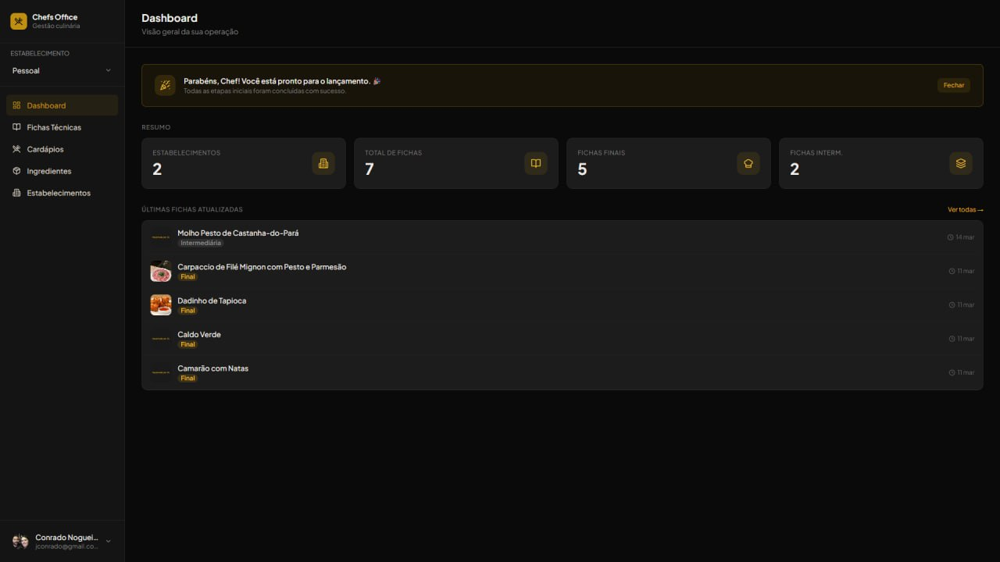
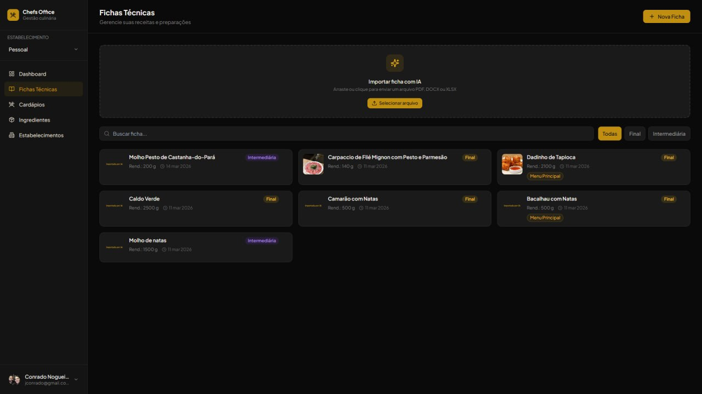
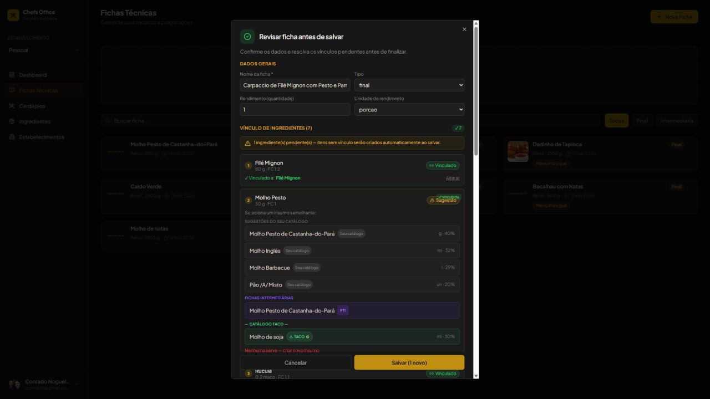
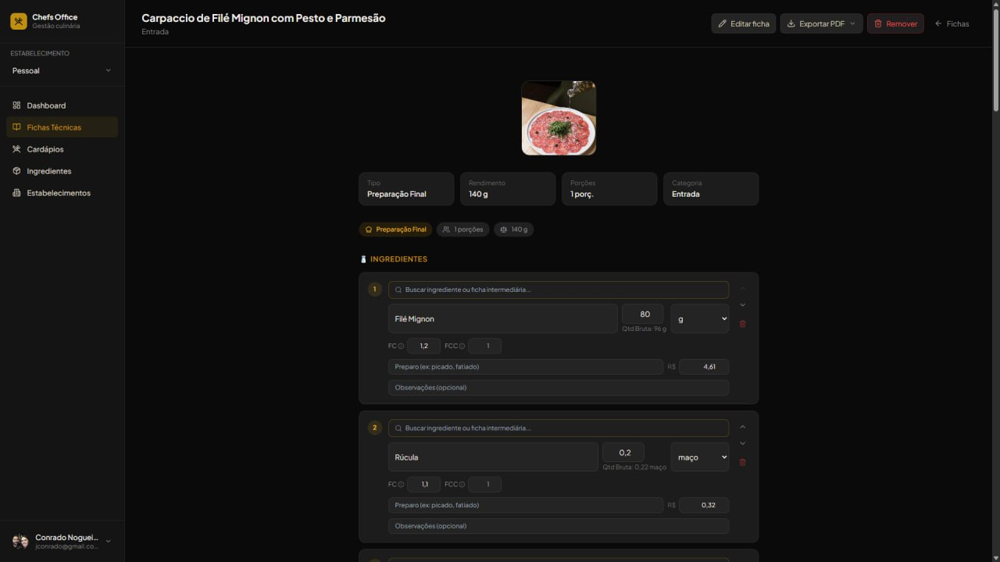
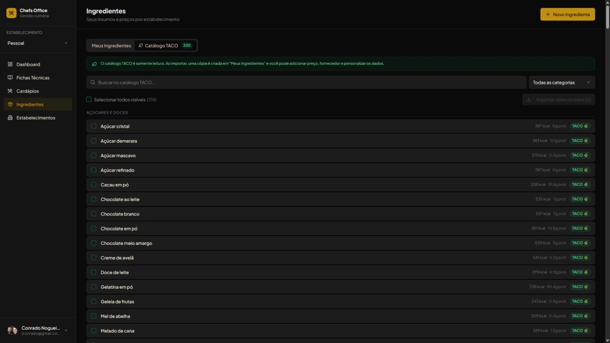

# Chefs Office

> SaaS platform for professional kitchen management — AI-powered recipe ingestion, cost analysis, and multi-establishment operations. Built by a professional chef with 8 years in the kitchen and 28 years in IT.

🔗 **[chefsoffice.com.br](https://www.chefsoffice.com.br)** — free tier available

[](https://react.dev/)
[](https://www.typescriptlang.org/)
[](https://supabase.com/)
[](https://ai.google.dev/)
[](LICENSE)

**Showcase repository** — full source available on request for technical evaluation.

---



---

## The Problem

Professional chefs manage dozens of technical recipe sheets (fichas técnicas) scattered across PDFs, spreadsheets, and paper notebooks. Costing a new dish means manually entering ingredients, applying correction factors, and recalculating every time a supplier changes a price. Scaling from one kitchen to multiple establishments multiplies the chaos.

Cloud tools exist but they're either too generic (built by developers who never cooked) or too expensive for independent restaurants and small chains.

Chefs Office was built from the inside out — by someone who actually worked the line for 8 years.

---

## What It Does

- **AI-powered recipe ingestion** — upload a PDF, Word doc, spreadsheet, or image of a handwritten recipe and Gemini 2.0 Flash extracts ingredients, quantities, preparation steps, and phases automatically
- **Smart ingredient resolution** — 4-layer matching: user catalog → 320-item global catalog (TACO/USDA) → sub-recipes → inline creation. No manual lookup.
- **Automatic cost calculation** — CMV%, price per portion, markup by factor, margin analysis — recalculated in real time as ingredient prices change
- **Chained sub-recipes** — an intermediate sheet (FTI) can be used as an ingredient inside a final sheet (FTP), with automatic cost propagation through the chain
- **Professional PDF exports** — recipe sheet, cost analysis (gerencial), and ANVISA-compliant nutritional report (RDC 429/2020), all generated in one click
- **Multi-establishment** — one account, multiple kitchens, independent pricing per location
- **Nutritional data** — calories, protein, carbs, fat, fiber from the Brazilian TACO table (UNICAMP) + USDA, with correction factors (FC/FCC) per ingredient category

---

## Screenshots



*Recipe library — drag and drop a PDF/DOCX/XLSX/image to import with AI*

---



*SmartImporter — each ingredient resolved across 4 layers with similarity scores: user catalog → sub-recipes → TACO/USDA catalog → create new*

---



*Recipe detail — FC (correction factor) and FCC (cooking factor) applied per ingredient, cost calculated in real time, sub-recipe linked inline*

---



*320-item TACO/USDA ingredient catalog — import any item to your establishment catalog with one click*

---


---

## PDF Outputs

Three report types generated from every recipe:

**Recipe Sheet** — photo, ingredients with FC/FCC, preparation steps by phase (pre-prep → prep → finishing → plating). The document that goes to the kitchen.

**Cost Analysis (Gerencial)** — cost per ingredient, total CMV%, markup factor, profit per portion, suggested sale price. Marked "USO INTERNO — CONFIDENCIAL". The document that stays in the owner's drawer.

**Nutritional Report** — ANVISA RDC 429/2020 compliant. Full nutrient breakdown per portion and per 100g, plus per-ingredient contribution table. Useful for menus, delivery platforms, and health certifications.

---

## Tech Stack

| Layer | Technology |
|---|---|
| Frontend | React 18 + TypeScript + Vite + Tailwind CSS + shadcn/ui |
| State management | TanStack Query v5 |
| Backend / Database | Supabase (PostgreSQL + Row Level Security + Auth + Storage) |
| AI pipeline | Gemini 2.0 Flash via Supabase Edge Function (Deno) |
| PDF generation | jsPDF + html2canvas |
| Automation | n8n (self-hosted, zero cost) |
| Deploy / CI | Lovable |

**Infrastructure cost in production: ~R$110/month (~$22 USD)**

---

## Architecture

```
Browser (React 18 + TypeScript)
    │
    ├── Supabase Auth (JWT)     — email/password + Google OAuth
    ├── Supabase PostgreSQL     — RLS on every table
    ├── Supabase Storage        — recipe photos
    └── Edge Function (Deno)   — AI processing, no API key on client
              │
              ├── POST /process-recipe-etl
              │     ├── Receives: PDF / DOCX / XLSX / image
              │     ├── Extracts text (DOCX/XLSX via XML unzip)
              │     ├── Calls Gemini 2.0 Flash with fallback chain
              │     │     gemini-2.0-flash → gemini-1.5-flash-8b → gemini-flash-latest
              │     └── Returns: structured ExtractedRecipe JSON
              │
              └── POST /delete-user
```

### Database Schema

```
profiles
establishments ──── establishment_members
                └── establishment_ingredients ──── ingredients (global catalog: user_id IS NULL)
                                                └── ingredients (user catalog: user_id = X)
recipes ──── recipe_ingredients ──── ingredients
         └── preparation_steps      └── sub_recipe_id → recipes  (chained FTI)
menus ──── menu_sections ──── menu_recipes ──── recipes
```

Key design decisions:
- Global ingredient catalog (`user_id IS NULL`) is read-only — imported via RPC before use
- `pg_trgm` similarity search for smart ingredient matching during import
- Database constraint prevents `recipe_ingredients` from referencing ingredients without an owner
- All AI processing happens server-side in Deno Edge Functions — Gemini API key never reaches the browser

---

## AI Import Pipeline

```
User uploads file (PDF / DOCX / XLSX / PNG / JPG)
    │
    ▼ Edge Function detects file type
    │   ├── DOCX/XLSX → unzip XML, extract text
    │   └── PDF/image → base64 encode (Gemini inline_data)
    │
    ▼ Gemini 2.0 Flash extracts structured data
    │   └── Fallback: gemini-1.5-flash-8b → gemini-flash-latest
    │
    ▼ SmartImporter resolves each ingredient in 4 layers
    │   1. User's catalog (exact + similarity match via pg_trgm)
    │   2. Global TACO/USDA catalog (320 ingredients)
    │   3. Existing sub-recipes (FTI)
    │   4. Inline creation if no match found
    │
    ▼ AI-inferred preparation steps marked with visual badge
        → User reviews and confirms before saving
```

---

## Ingredient Catalog

- **320 items** based on Brazilian TACO nutritional table (UNICAMP) + USDA data
- FC (Correction Factor) and FCC (Cooking Factor) per category — applied automatically
- Full nutritional profile: calories, protein, carbs, fat, fiber
- Each establishment maintains independent pricing per ingredient

---

## Development Workflow

Built with a deliberately structured AI-first workflow:

| Tool | Role |
|---|---|
| **Claude Code** | Complex logic, SQL, RPCs, architecture decisions |
| **Gemini** | Frontend components, UI iteration |
| **Lovable** | React/Tailwind UI generation, CI/CD pipeline |
| **n8n** (self-hosted) | Notification automation, zero operational cost |

---

## Roadmap

| Feature | Status |
|---|---|
| Core recipe management | ✅ Production |
| AI recipe import (PDF/DOCX/XLSX/image) | ✅ Production |
| Multi-establishment | ✅ Production |
| PDF export (recipe + cost analysis + nutritional) | ✅ Production |
| ANVISA RDC 429/2020 nutritional report | ✅ Production |
| 320-item TACO/USDA ingredient catalog | ✅ Production |
| Google OAuth | ✅ Production |
| Pro / billing system | 🔄 In development |
| Mobile app | 📋 Planned |
| Supplier price integration | 📋 Planned |

---

## About

Built by **Conrado Nogueira** — 8 years as a professional chef + 28 years in IT infrastructure.

The domain knowledge in this product is not cosmetic. The correction factor system, the chained sub-recipe architecture, the 4-phase preparation step model (pre-prep → prep → finishing → plating), the "USO INTERNO — CONFIDENCIAL" stamp on the cost analysis — these come from real kitchen experience, not assumptions.

In active use for professional culinary consulting.

[github.com/JConradoN](https://github.com/JConradoN) · Available for freelance projects (USD/EUR)

---

*Showcase repository — full source available on request for technical evaluation.*
